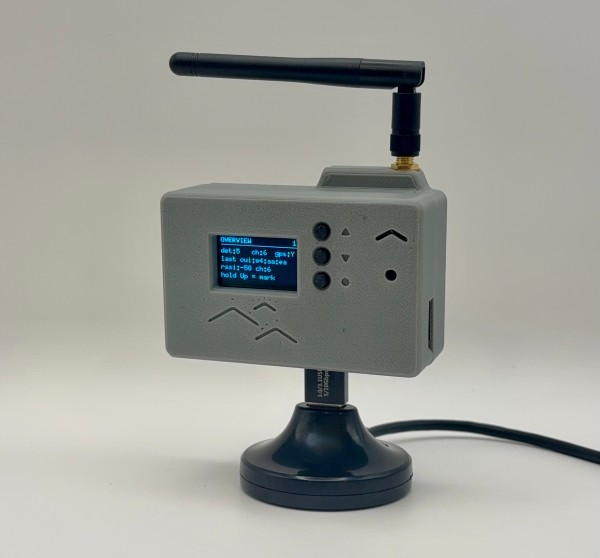

<p align="center">
  
</p>

# Birdoscope Firmware

Detection and data capture firmware for locating Flock and other surveillance
infrastructure. It is intended to allow you to build a dedicated device to
help develop high-confidence position estimates, capture analytic data on
Flock devices, and inform discussions about the deployment of mass public 
surveillance.

<p align="center">
  
</p>

## What it does

Birdoscope enables automatic Flock detection with an ESP32 and common hardware. 
It logs data for visualization and analysis, and allows you to customize various 
features on the fly through the admin web console.

This is intended to work across several common ESP-based MCUs without requiring
peripherals, but the scope has changed somewhat as I've added features. Currently
the custom PCBs and peripheral modules are non-optional for a working device unless
you want to breadboard from schematics. It's how the v0.1 was done, but it's not
ideal.

This is intended as a feeder device to the birdoscope-analytics app which ingests
capture data and allows you to map observed cameras, look for commonalities, and
identify patterns (among other things). Please see the hardware doc for an explanation
of the different models.

## How it works

Plug in the device and put it in your car or on your backpack. It will beep and
flash when you are in range of a flock or other surveillance devices (Axon, etc.).
Flipping through the screen carousel will give you detail about the kinds of devices
you've observed (or been observed by), and summary analytic data.

If you are interested in more detailed information, pull the logs off the SD card and
feed them to the analytics pipeline to create an interactive map where you can record
notes and do correlational analysis on your computer. The map only runs locally right now, 
an option to upload privatized capture data to a public db is on the roadmap.

The device scans in flock-you custom mode by default. To retrieve captured data, put it
in Admin mode through the screen carousel. It will pause scanning and raise a WiFi 
access point (`Birdoscope-Setup`) hosting a small web console at `http://birdoscope.local/`
or `http://10.99.7.1/`. From there you can download the stored session, and any prior logs
on SD-equipped boards.

The detection logic is explained in detail (`docs/detection_methods.md`), and is 
evolving daily as more information comes in. The detection logic is based on the original
work of Colonel Panic, NitekryDPaul, DeFlockJoplin, and others.

Quickstart guide at (`docs/quickstart.md`)

## Supported hardware

I have used different boards at different times while working on this. The goal
is to have this working on the most common ESP32 models, but maintaining all of
them while working on features was unmanageable. Currently the main branch is only confirmed
working on ESP32-S3-N16R8, equivalent boards are on the roadmap.

Boards with working or easily ported configs have been left in `platformio.ini`:

| Board | Environment |
|---|---|
| Heltec WiFi LoRa 32 V4 | `heltec_v4` |
| ESP32-S3-DevKitC-1 N16R8 | `esp32-s3-devkitc1-n16r8` |
| ESP32-S3-DevKitC-1 N8R2 | `esp32-s3-devkitc1-n8r2` |
| ESP32 Round LCD (GC9A01) | `esp32round` |

Per-board pinouts live in [`docs/hardware/`](docs/hardware/), and
[`docs/hardware_variants.md`](docs/hardware_variants.md) covers how the variants
differ.

Heltec_v3 should work as well, but is unverified and does not have a carrier
board yet. Please verify pinouts before flashing with the v4 profile, but it
should be fine.

The code is structured to allow you to create a board profile for whatever you
have avaialable by separating the core detection and logging functionality from
hardware-specific constraints.

Just create a board environment in the PIO ini, then copy and customize a 
board_config.h file under 
[`include/boards/<your-board-here>`](include/boards/<your-board-here>). 
Once you've set pin assignments and other persistent config variables, it should
flash without issue when you pio run with the new env as the target. If you are 
not using a carrier board, breadboard in the peripherals with the given pinouts.

## Building

Birdoscope builds with [PlatformIO](https://platformio.org/).

Shared libraries live in the `jellybeans` repo, vendored here as a submodule, so
clone recursively:

```bash
git clone --recursive https://github.com/LoneCrowDesign/birdoscope-firmware.git
```

If you already cloned without it, run `git submodule update --init --recursive`.
The build stops with that instruction if the submodule is missing.

Then pick the environment matching your board:

```bash
pio run -e esp32-s3-devkitc1-n16r8                 # build
pio run -e esp32-s3-devkitc1-n16r8 -t upload       # build and flash
pio device monitor -b 115200                       # watch serial output
```

Host-side Python tooling, used only by the serial debug scripts, installs
separately:

```bash
python3 -m venv .venv
.venv/bin/pip install -r requirements.txt
```

See [`tools/serial_debug/README.md`](tools/serial_debug/README.md) for what
those scripts do and the bring-up gotchas they exist to work around.

### Knowing which build is on a device

Every build stamps itself with its git identity, so a device in the field can
say which commit it is running rather than leaving it to be reconstructed from
file timestamps afterwards. It appears in four places:

- The boot splash on OLED boards, for the few seconds after a flash.
- The first line of the boot serial log, so it appears in any captured session.
- `status`, on both the serial and web consoles.
- The session manifest and the `boot` event, so a capture carries the build that
  produced it.

The build time also serves as a clock floor. A GPS fix reporting a time earlier
than the build cannot be correct, so it is refused and the session stays
unanchored rather than adopting a wrong time.

A build from a tree with uncommitted changes reports a `-dirty` suffix, which
is the case that is otherwise impossible to pin down later. A build with no git
available reports `unknown` rather than claiming an identity it does not have.

Two limits on how far to trust the string:

- `-dirty` covers modified tracked files only, so a tree holding a brand-new
  untracked source file still reports clean.
- The stamp is computed when the build runs, not when the binary is linked, so
  a tree that is edited, built, reverted and built again can relink from cache
  and report the earlier answer.

Neither applies to the ordinary case of flashing whatever is checked out.

`tools/git_version.py` does the stamping, wired in from `[common]` in
`platformio.ini`, so every environment inherits it.

### Logging and Metadata

I recently spent a laughable amount of time developing a single logging interface
intended to work for whatever hardware and config is thrown at it. This is still
being stress-tested, and may break easily. It is deliberately picky to prevent
drift between devices that would break the analytics pipeline.

## Credit

This project builds on the work of:

- @colonelpanichacks, whose flock-you firmware this is forked from and which
  informed many design decisions
- @NitekryDPaul, for the list of OUI targets, the original
  firmware, and promiscuous-mode detection
- @DeFlockJoplin, for research on the wildcard probe request signatures of Flock
  infrastructure
- @JosephHewitt, for the wardriver_r3 hardware and firmware used for associated
  metadata capture and correlational analysis
- The reporting of @DeFlock.org, @BennJordan, @404Media, @EFF, @Proton, and many
  others covering this topic

Code derived from upstream keeps its original symbol names as a provenance
marker, so the source itself records where a mechanism came from. See `NOTICE`.

## Use of AI

I leaned heavily on AI to implement several parts of this project. If you consider
all AI-assisted or fully-generated code to be suspect or outright garbage, I get
it, but there are better places to debate it. The point of this project is to find
surveillance infrastructure so that people can have informed conversations about it.
Please feel free to take from the many all-human elements of the project and build
to your taste.

## Documentation

- [Supported hardware variants](docs/hardware_variants.md)
- [Per-board pinouts](docs/hardware/)
- [Onboard configuration](docs/onboard_config.md)
- [Detection methods](docs/detection_methods.md): frame semantics, geometry, and
  what each detection type does and does not show
- [Alert behaviour](docs/alerts.md): chirp and flash reference
- [Distance estimation](docs/distance_estimation.md): the range model, calibration,
  and its limits
- [Roost logging](docs/roost_logging.md): what a session writes and how the
  logging contract is shared across the fleet

## License

Original contributions are MIT licensed. Catch as many as you can, however you want.
See [LICENSE](LICENSE).

[NOTICE](NOTICE) records the upstream provenance and one important caveat: the
firmware links the jellybean WebConsole which is GPLv3. A distributed firmware
binary is a combined work governed by GPLv3. The MIT license covers this project's own
source.
