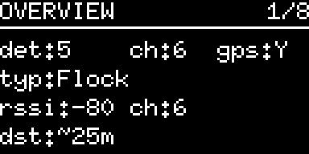
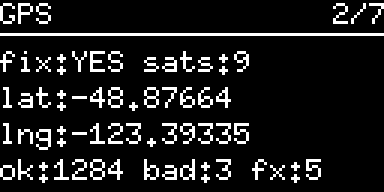
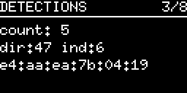
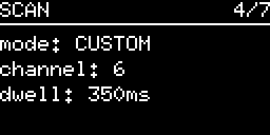
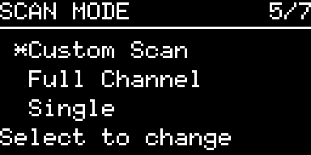
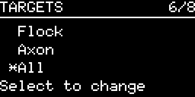
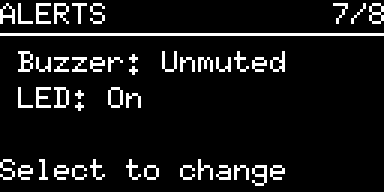
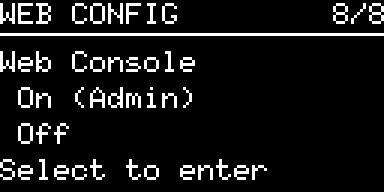
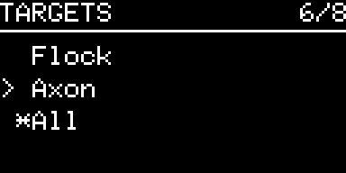

# Menu UX

The on-device screens and menus. State, meaning the current screen and menu
selection, lives in `lib/birdoscope_core` so every board renders the same model,
and each board `main` owns only the pixels. The physical input hardware sits
behind a semantic nav layer, so a later board revision can swap the buttons for
an encoder, a 4-button pad, or a 5-way switch without touching this logic. See
[Input hardware](#input-hardware).

The carousel and menus below are wired today on the Birdoscope Analyze r0.1
(ESP32-S3), which has three buttons and `NAV_SCHEME_3BTN`. Flash it with
`analyze_r01_n8r2` or `analyze_r01_n16r8`. Boards with two buttons keep the
older toggle and mark input (`coreInputTick`) and their single status view, and
the round TFT board renders its own UX. See [Board parity](board_parity.md).

## Top-level screens (carousel)

Up and Down cycle through eight screens, wrapping at both ends. Four are
read-only detail views and four are menus you drill into with Select.

1. Overview: detection count, channel, GPS fix flag (Y/N), and for the last hit
   its vendor, RSSI, channel, and a rough distance estimate. Shows `scanning...`
   until the first detection.

   

2. GPS: fix status and satellite count, current position, and parser health
   counters (ok and bad checksums, fix-carrying sentences), matching the `[gps]`
   serial line.

   

3. Detections: count and last detection MAC.

   

4. Scan: current channel, dwell time, and mode.

   

5. Scan Mode (menu): Custom Scan, Full Channel, or Single, which opens a channel
   picker.

   

6. Targets (menu): Flock, Axon, or All, the vendors the OUI matcher accepts.

   

7. Alerts (menu): Buzzer Muted/Unmuted and LED On/Off, toggled in place.

   

8. Web Config (menu): Web Console On or Off, the Admin-mode entry.

   

Screens are rendered from the firmware's own drawing code by
`tools/screen_render`, not photographed, so they track the display exactly. The
sample values are a stand-in scan, not a real capture. Image filenames follow the
renderer's frame order rather than the carousel positions above, so that adding a
screen does not rename the existing files.

### Scan Mode menu

Switches the channel strategy live, in RAM, resetting to the board default of
Custom on reboot. The active mode is marked `*` and the cursor is `>`.

- **Custom Scan**: hop the board's custom list (1, 6, 11) at the default dwell.
- **Full Channel**: hop channels 1 through 11.
- **Single**: lock to one channel for stationary close-listen capture. Selecting
  it opens a channel picker, where Up and Down dial 1 to 13, Select sets the
  channel, and long-Back cancels back to the list.

### Targets menu

Selects which vendors the OUI matcher accepts, live and in RAM, resetting to All
on reboot. Deliberately orthogonal to Scan Mode: Targets picks what to look for,
Scan Mode picks where to listen. Act-and-close, the same idiom as Scan Mode, with
the active target marked `*` and the cursor `>`.

- **Flock**: the 31 Flock Safety prefixes only.
- **Axon**: the four Axon prefixes only, covering the Axon, VieVu and Fusus
  registrations.
- **All**: every prefix in the table. The default, and the right choice for
  discovery, since matching costs nothing extra and the narrower targets only
  discard hits.

Narrowing does not speed up scanning or change channel behaviour. It exists to
keep the logs and alerts from one drive attributable to a single vendor.



### Alerts menu

Toggles the on-device alert feedback live, in RAM, with both defaulting to
enabled on reboot, the same session-only convention as the scan mode.

Each row shows its current state. Select flips the highlighted row in place and
stays in the list, unlike the act-and-close Scan Mode and Web Config menus, so
both rows can be set before long-Back pops out. The gates live in core
(`coreBuzzerEnabled`, `coreLedEnabled`), so a board without the Alerts screen
still honors them.

- **Buzzer, Unmuted or Muted**: gates the new-detection chirp. The boot jingle
  and the on-demand `chirp` and `jingle` verbs are unaffected.
- **LED, On or Off**: gates the detection and heartbeat LED flashes. The boot
  RGB cycle and the SD-init blink are unaffected.

### Web Config menu

Starts and stops the Admin-mode web portal:

- **On (Admin)**: enters the software access point (SoftAP) web portal, which
  pauses scanning. This is the Admin gesture for a board with controls. The BOOT
  double-press remains the universal enter and exit escape on every board.
- **Off**: closes the menu and returns to the resting Detect state.

## Round TFT screens (esp32round)

The round GC9A01 board renders its own UX rather than the carousel above. It has
two screens, toggled with the IO19 button.

- **Scan screen** (default): a small procedural flock of birds, a handful of
  chevron shapes, stays centered at all times. While idle the background is
  black. When a camera is actively in range, meaning within
  `HB_DEVICE_ACTIVE_MS` (3 s) of the last hit, the background turns red and a
  ring and pointer marker are drawn at the screen edge on top of the flock. The
  pointer position is driven by RSSI on a 270° gauge. The pointer is a
  proximity indicator, not a compass direction, since that board has no bearing
  or antenna-array hardware.
- **Count screen**: a "Flocks:" label with the session detection count, large
  and centered.

Switching screens only changes what is rendered, since `displayTick()` branches
on `currentScreen`. The WiFi promiscuous callback, SPIFFS persistence, and SD
logging are untouched by which screen is showing.

IO4 fires the manual area-of-interest marker. See
[the board's pinout](hardware/hardware_esp32round.md) for the wiring.

## Control grammar

One grammar applies at both levels: move, confirm, back. On the 3-button board:

| Button | Gesture | Top level                                       | Inside a menu             |
|--------|---------|-------------------------------------------------|---------------------------|
| BTN_1  | short   | Up, advance to the next screen (1→2→…→8, wraps) | move highlight up         |
| BTN_1  | long    | Mark (area-of-interest)                         | Mark (area-of-interest)   |
| BTN_2  | short   | Down, back a screen (wraps)                     | move highlight down       |
| BTN_3  | short   | enter menu (menu screens only)                  | confirm selection         |
| BTN_3  | long    | no action                                       | Back, exit without change |

The carousel behaves as a spinner, where Up means a higher screen number, which
matches the Single-channel picker where Up means a higher channel. A menu list
uses the usual convention instead, where Up moves the highlight toward the first
item. The two differ because the visual contexts differ.

Manual mark keeps a dedicated, always-available gesture on long BTN_1 rather
than an overloaded context press, because it has to work on any screen. Firing it
flashes a brief "Saved Manual Record!" overlay for 1.5 seconds, which is the only
on-screen indication; no screen prints the gesture.

## Semantic nav layer

`coreNavTick()` maps the physical buttons, distinguishing short from long press
per `NAV_SCHEME`, into display-independent events. `coreNavApply()` feeds those
into the screen and menu state machine:

| Event                 | Meaning                                  |
|-----------------------|------------------------------------------|
| `NAV_UP` / `NAV_DOWN` | move (screen carousel or menu highlight) |
| `NAV_SELECT`          | enter menu or confirm                    |
| `NAV_BACK`            | exit menu without change                 |
| `NAV_MARK`            | manual area-of-interest marker           |

Events also arrive from the serial nav injector, so the whole screen and menu
machine can be driven with no physical input:

```text
nav up | nav down | nav select | nav back | nav mark
```

## Serial commands

Commands are word-based, using brief noun and verb tokens, and are
newline-terminated. Core owns the shared verbs and each board adds its own.

| Command                              | Owner         | Action                       |
|--------------------------------------|---------------|------------------------------|
| `status`                             | board         | print status                 |
| `inject`                             | board         | inject a synthetic detection |
| `log`                                | board (SD)    | dump the SD log              |
| `dump`                               | core          | dump current session (JSON)  |
| `prev`                               | core          | dump previous session (JSON) |
| `nav <up\|down\|select\|back\|mark>` | core          | inject a nav event           |
| `chirp` / `jingle`                   | core (buzzer) | play a tone                  |
| `help` / `?`                         | board         | list commands                |

### Web console parity

The Admin-mode web console (`lib/birdoscope_core/web_portal.cpp`, backed by
WebConsole) registers
the same verbs, so it stands in fully for the UART console and its `help` lists
everything. Differences on the web side:

- `dump` and `prev` stream the SPIFFS session JSON into the web log, capped at
  8 KB and batched, with a download fallback.
- `log` defaults to the CSV header plus the last 10 rows, held in a RAM-safe
  rolling window. `log full` streams the whole file. It always draws from the
  currently active log (`sdLog`), which is `/log.csv` until GPS anchors a
  timestamped name and then follows the rename. Output is batched so a bulk dump
  cannot overrun the WebSocket and drop the client.
- `gps` prints the GPS detail (fix, satellites, position, and parser counters)
  on demand. The web console has no equivalent of the serial `[gps]` 5-second
  auto-line.
- `inject` and `nav` are Detect-loop actions and no-op in Admin, where scanning
  is paused.
- `wifi` is a pinned form taking an SSID and password. It saves the network used
  for the boot-time NTP time-sync fallback, the one that applies when no GPS
  module is detected. Credentials are stored to SPIFFS at `/wifi.json` and
  consumed at the next boot. Submitting an empty SSID reports the currently
  saved network, and `wifi-forget` erases it. This is web-only, since it needs a
  form. The password is never echoed back.
- `calibrate` tunes the distance estimate behind the Overview screen's `dst:` row.
  It takes an Environment Density preset (low, medium, or high) and `rssi_1m`, the
  expected RSSI one metre from a target. `rssi_trim` steps that reference instead
  of replacing it, which is the in-field adjustment when an estimate is visibly
  wrong. Both settings persist to SPIFFS at `/settings.json` and reload at boot.
  Submitting nothing reports the active model against the last real detection.
  Changes apply to the next detection rather than rescaling the estimate already
  on screen. Web-only, since it needs a form. See
  [Distance estimation](distance_estimation.md).
- Pinned buttons in the Controls card are `status`, `wifi`, and `help`, though
  typing `help` still uses the client-side listing. `chirp` and `jingle` are
  unpinned typed verbs.
- `session`, `prev_session`, and the SD CSVs are also one-click downloads.

## Input hardware

The semantic nav layer is the swap point. Supporting a new control type means
adding a `NAV_SCHEME_*` implementation in `coreNavTick()` that emits the same
events. Nothing downstream changes: the screen carousel, the menu state machine,
and every board's render code stay as they are.

The current scheme is `NAV_SCHEME_3BTN`, three buttons distinguished by short
and long press.

Runtime settings, meaning the scan mode and the Single-mode channel, are
session-only by design. The device always boots to the board defaults and
nothing is persisted.
