# Menu UX

The on-device screens and menus. State, meaning the current screen and menu
selection, lives in `lib/birdoscope_core` so every board renders the same model,
and each board `main` owns only the pixels. A semantic nav layer sits between
the physical input and this logic, so a later board revision can swap the
buttons for an encoder, a 4-button pad, or a 5-way switch without touching it.
See [Input hardware](#input-hardware).

The Birdoscope Analyze boards (ESP32-S3) run the carousel and menus below. r0.1
has three buttons and `NAV_SCHEME_3BTN`, flashed with `analyze_r01_n8r2` or
`analyze_r01_n16r8`. r0.4 has four and `NAV_SCHEME_4BTN`, flashed with
`analyze_r04_n16r8_dev` or `analyze_r04_n16r8_bare`. Boards with two buttons
keep the toggle and mark input (`coreInputTick`) and their single status view,
and the round TFT board renders its own UX. See
[Board parity](board_parity.md).

## Top-Level Screens (Carousel)

Up and Down cycle through ten screens, wrapping at both ends. Four show
read-only detail and six are menus you drill into with Select. Scan Mode
applies to 802.11 only, so the carousel skips it while BLE is the selected
radio.

1. Overview shows the detection count, channel, GPS fix flag (Y/N), and for the
   last hit its vendor, RSSI, channel, and a rough distance estimate. It reads
   `scanning...` until the first detection. In BLE mode it shows the BLE device
   count and, for the last device, its vendor, RSSI, advertisement count, and
   serial or MAC. An accessory match reads `acc` after the vendor. BLE has no
   channel or distance.

   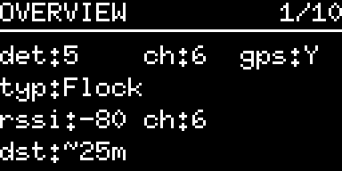
   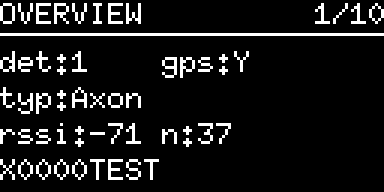

2. GPS shows fix status and satellite count, current position, and parser
   health counters (ok and bad checksums, fix-carrying sentences), matching the
   `[gps]` serial line.

   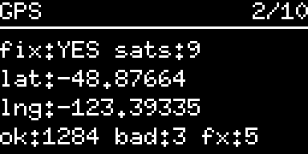

3. Detections shows the device count, the direct and indirect device counts,
   the last detection MAC, and a frame baseline. `dir` and `ind` count cameras
   and overlap, so one seen both ways counts in each and their sum can exceed
   the total. The bottom row counts all traffic, matched or not, with its rate
   and the uptime, which separates a quiet area from a deaf radio. It reads
   `seen:` for 802.11 frames and `adv:` for BLE advertisements. In BLE mode
   `hits:` replaces `dir` and `ind`, since every BLE detection is direct. See
   [Detection methods](detection_methods.md).

   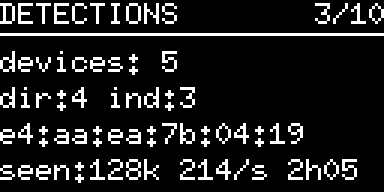
   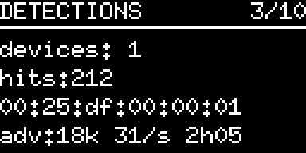

4. Scan shows the current channel, dwell time, and mode. In BLE mode it reads
   `mode: BLE passive` and shows the advertisement count and the 1M and coded
   PHY split instead.

   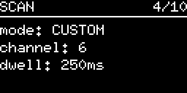
   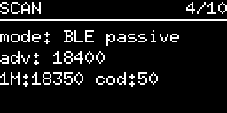

5. Scan Mode (menu) offers Custom Scan, Full Channel, or Single, which opens a
   channel picker. 802.11 only.

   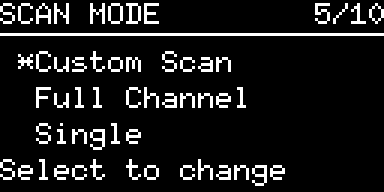

6. Targets (menu) offers Flock, Axon, Motorola, or All, the vendors the matcher
   accepts on both radios.

   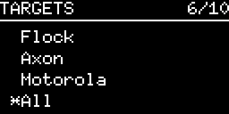

7. Radio (menu) offers 2.4GHz or BLE, the radio that captures.

   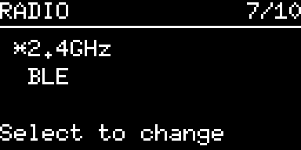

8. Alerts (menu) toggles Buzzer Muted/Unmuted and LED On/Off in place, and
   holds the proximity ring, which opens a range picker.

   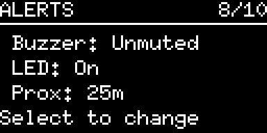

9. Web Config (menu) offers Web Console On or Off, the Admin-mode entry.

   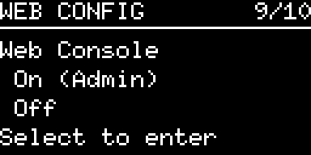

10. Device Wipe (menu) offers Wipe Device or Wipe Device + Card, each behind a
    three-press confirmation.

    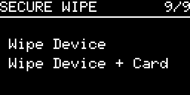

### Scan Mode Menu

Switches the channel strategy live, and resets to the board default of Custom on
reboot. `*` marks the active mode and `>` the cursor.

- **Custom Scan** hops the board's custom list (1, 6, 11) at the default dwell.
- **Full Channel** hops channels 1 through 11.
- **Single** locks to one channel for stationary close-listen capture. It opens
  a channel picker, where Up and Down dial 1 to 13, Select sets the channel, and
  Back returns to the list.

### Targets Menu

Selects which vendors the OUI matcher accepts, live and in RAM, resetting to All
on reboot. Targets picks what to look for, and Scan Mode picks where to listen.
Selecting an entry acts and closes the menu, as in Scan Mode, with `*` on the
active target and `>` on the cursor.

- **Flock** matches Flock Safety prefixes, and the Penguin battery pack on BLE.
- **Axon** matches the Axon, VieVu and Fusus registrations, and the Axon serial
  rule on BLE.
- **Motorola** matches Motorola Solutions, Avigilon Alta and WatchGuard Video,
  and the Motorola Solutions company identifier on BLE.
- **All** matches every vendor in the table, including those with no row of
  their own. It is the default and the right choice for discovery, since
  matching costs nothing extra and the narrower targets only discard hits.

Narrowing leaves scan speed and channel behavior unchanged. It keeps the logs
and alerts from one drive attributable to a single vendor.

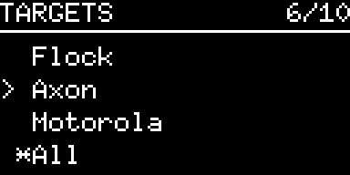

### Radio Menu

Selects which radio captures, live and in RAM, resetting to 2.4GHz on reboot.
The two are exclusive, so a switch stops one radio fully before starting the
other. Selecting an entry acts and closes the menu, with `*` on the active radio
and `>` on the cursor.

- **2.4GHz** runs 802.11 promiscuous capture under the Scan Mode channel plan.
- **BLE** runs passive BLE scanning, and the device transmits nothing.

A board without BLE capture hides this screen and refuses the switch.

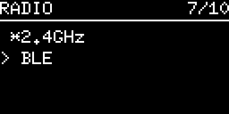

### Alerts Menu

Sets the on-device alert feedback live. The two gates reset to enabled on
reboot, like the scan mode. The proximity ring persists, like the distance
settings.

Each row shows its current state. Select flips the highlighted gate in place and
stays in the list. Core holds the state (`coreBuzzerEnabled`, `coreLedEnabled`,
`coreProxRingM`), so a board without the Alerts screen can use it as well.

- **Buzzer, Unmuted or Muted** gates the new-detection and proximity chirps.
  The boot call and the on-demand `chirp`, `prox` and `jingle` verbs ignore it.
- **LED, On or Off** gates the detection and proximity LED pulses. The boot RGB
  cycle and the SD-init blink ignore it. No board with a screen runs the
  heartbeat pulse, so this gate never applies to it.
- **Prox, a range or Off** opens a picker for the proximity ring (Off, 10 m,
  25 m, 50 m, 100 m), the range at which a tracked target chirps again as you
  close on it. Select applies and saves the range, and Back leaves it unchanged.
  See [Alert behavior](alerts.md).

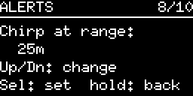

### Web Config Menu

Starts and stops the Admin-mode web portal.

- **On (Admin)** enters the software access point (SoftAP) web portal, which
  pauses scanning. This is the Admin gesture for a board with controls.
- **Leaving Admin** takes a double press of Back within `NAV_BACK_DOUBLE_MS`,
  600 ms by default, or a hold for `NAV_EXIT_HOLD_MS`, 3 seconds. A single click
  leaves the portal up, so a stray press in a bag or pocket cannot drop
  it. Analyze r0.4 clears `BOOT_ADMIN_TRIGGER`, so these two gestures are its
  only button routes out. The web console command and the idle timeout also
  release the portal.

  The double press needs a dedicated Back button, so only the 4-button scheme
  has it. Under the 3-button scheme Back is a long press of BTN_3, and those
  boards keep the BOOT double-press instead.
- **Off** closes the menu and returns to the resting Detect state.

### Device Wipe Menu

Erases the unit so you can sell, donate, or hand it on. Either wipe option opens
a confirmation screen that takes three presses of Confirm. When the wipe
finishes, the device enters deep sleep, and you power cycle it to start fresh.

- **Wipe Device** clears onboard state only. It zeroes the detection table,
  formats SPIFFS, and erases the whole NVS partition. Use it when you pull and
  replace the card.
- **Wipe Device + Card** does the above, then recursively removes every entry
  in the card's root.

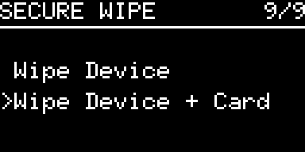

## Round TFT Screens (esp32round)

The round GC9A01 board renders its own UX in place of the carousel above. It has
two screens, toggled with the IO19 button.

- **Scan screen** (default) keeps a small procedural flock of birds, a handful
  of chevron shapes, centered at all times. While idle the background is black.
  When a camera is in range, meaning within `HB_DEVICE_ACTIVE_MS` (3 s) of the
  last hit, the background turns red, and the board draws a ring and pointer
  marker at the screen edge on top of the flock. RSSI drives the pointer around
  a 270° gauge. The pointer shows proximity only, since that board has no
  bearing or antenna-array hardware.
- **Count screen** shows a `Flocks:` label with the session detection count,
  large and centered.

Switching screens only changes what the board draws, since `displayTick()`
branches on `currentScreen`. The WiFi promiscuous callback, SPIFFS persistence,
and SD logging run the same on either screen.

IO4 fires the manual area-of-interest marker. See
[the board's pinout](hardware/hardware_esp32round.md) for the wiring.

## Control Grammar

One grammar applies at both levels, move, confirm, back. On the 3-button board
the buttons map as follows.

| Button | Gesture | Top level                                       | Inside a menu             |
|--------|---------|-------------------------------------------------|---------------------------|
| BTN_1  | short   | Up, advance to the next screen (wraps)          | move highlight up         |
| BTN_1  | long    | Mark (area-of-interest)                         | Mark (area-of-interest)   |
| BTN_2  | short   | Down, back a screen (wraps)                     | move highlight down       |
| BTN_3  | short   | enter menu (menu screens only)                  | confirm selection         |
| BTN_3  | long    | no action                                       | Back, exit without change |

The carousel behaves as a spinner, where Up means a higher screen number, which
matches the Single-channel picker where Up means a higher channel. A menu list
uses the usual convention instead, where Up moves the highlight toward the first
item.

Manual mark has a dedicated gesture on long BTN_1, because it has to work on any
screen. Firing it flashes a "Saved Manual Record!" overlay for 1.5 seconds, the
only on-screen sign of the gesture.

## Semantic Nav Layer

`coreNavTick()` maps the physical buttons, distinguishing short from long press
per `NAV_SCHEME`, into display-independent events. `coreNavApply()` feeds those
into the screen and menu state machine.

| Event                 | Meaning                                  |
|-----------------------|------------------------------------------|
| `NAV_UP` / `NAV_DOWN` | move (screen carousel or menu highlight) |
| `NAV_SELECT`          | enter menu or confirm                    |
| `NAV_BACK`            | exit menu without change                 |
| `NAV_MARK`            | manual area-of-interest marker           |

The serial nav injector also sends events, so you can drive the whole screen and
menu machine with no physical input.

```text
nav up | nav down | nav select | nav back | nav mark
```

## Serial Commands

Commands are newline-terminated words, brief noun and verb tokens. Core owns the
shared verbs and each board adds its own.

| Command                              | Owner         | Action                       |
|--------------------------------------|---------------|------------------------------|
| `status`                             | board         | print status                 |
| `inject`                             | board         | inject a synthetic detection |
| `log`                                | board (SD)    | dump the SD log              |
| `dump`                               | core          | dump current session (JSON)  |
| `prev`                               | core          | dump previous session (JSON) |
| `nav <up\|down\|select\|back\|mark>` | core          | inject a nav event           |
| `chirp` / `jingle`                   | core (buzzer) | play a tone                  |
| `crow` / `hawk`                      | core (buzzer) | play either boot call        |
| `help` / `?`                         | board         | list commands                |

### Web Console Parity

The Admin-mode web console (`lib/birdoscope_core/web_portal.cpp`, backed by
WebConsole) registers the same verbs, so it stands in fully for the UART console
and its `help` lists everything. The web side differs in these ways.

- `dump` and `prev` stream the SPIFFS session JSON into the web log, capped at
  8 KB and batched, with a download fallback.
- `log` defaults to the CSV header plus the last 10 rows, held in a RAM-safe
  rolling window. `log full` streams the whole file. It reads the open
  session's `wifi_obs` file and follows the directory rename when GPS anchors
  the clock. The console batches output so a bulk dump cannot overrun the
  WebSocket and drop the client.
- The Logs page lists each session directory's files, and any `.csv` in the
  card's root, as download links.
- `gps` prints the GPS detail (fix, satellites, position, and parser counters)
  on demand. The web console has no equivalent of the serial `[gps]` 5-second
  auto-line.
- `inject` and `nav` are Detect-loop actions and do nothing in Admin, which
  pauses scanning.
- `wifi` is a pinned form taking an SSID and password. It saves the network the
  boot-time NTP time sync uses when no GPS module is present. The firmware
  stores the credentials to SPIFFS at `/wifi.json` and reads them at the next
  boot. Submitting an empty SSID reports the saved network, and `wifi-forget`
  erases it. This is web-only, since it needs a form. The console never echoes
  the password.
- `calibrate` tunes the distance estimate behind the Overview screen's `dst:`
  row. It takes an Environment Density preset (low, medium, or high) and
  `rssi_1m`, the expected RSSI one meter from a target. `rssi_trim` steps that
  reference without replacing it, for in-field adjustment when an estimate is
  visibly wrong. Both settings persist to SPIFFS at `/settings.json` and reload
  at boot. Submitting nothing reports the active model against the last real
  detection. Changes apply from the next detection, and the estimate already on
  screen stays as it is. Web-only, since it needs a form. See
  [Distance estimation](distance_estimation.md).
- The Controls card pins `status`, `wifi`, and `help`, and typing `help` still
  uses the client-side listing. Both consoles accept the tone tests `chirp`,
  `prox`, `jingle`, `crow` and `hawk` as typed verbs, with no pinned button. A
  board with no buzzer reports them as unknown. Each verb acknowledges on the
  console, so you can tell it from a silent failure.
- `session`, `prev_session`, and the SD CSVs are also one-click downloads.

## Input Hardware

The semantic nav layer is the swap point. Supporting a new control type means
adding a `NAV_SCHEME_*` implementation in `coreNavTick()` that emits the same
events. The screen carousel, the menu state machine, and every board's render
code stay as they are.

Two schemes exist. `NAV_SCHEME_3BTN` uses three buttons distinguished by short
and long press. `NAV_SCHEME_4BTN` is the same grammar with Back moved to a
fourth button as a short press, so Confirm has no long press. Both emit
identical events, and a board picks one in its `board_config.h`.

| Button | `NAV_SCHEME_3BTN`        | `NAV_SCHEME_4BTN`   |
|--------|--------------------------|---------------------|
| 1      | short Up, long Mark      | short Up, long Mark |
| 2      | short Down               | short Down          |
| 3      | short Confirm, long Back | short Confirm       |
| 4      | not present              | short Back          |

Holding Back for 3 seconds emits `NAV_BACK_HOLD` on either scheme, meaning long
button 3 on the three-button boards and long button 4 on the four-button ones.
Only the Admin screen consumes it. On four buttons the hold cancels the click
that release would otherwise send. On three buttons Back has already fired at
the 500 ms mark, which Admin discards.

The scan mode, the Single-mode channel and the alert gates reset to the board
defaults at every boot. The proximity ring and the `calibrate` settings persist,
as the Alerts and Web Config sections above describe.
